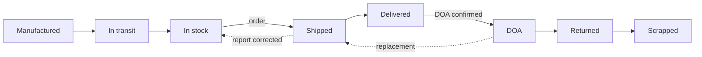
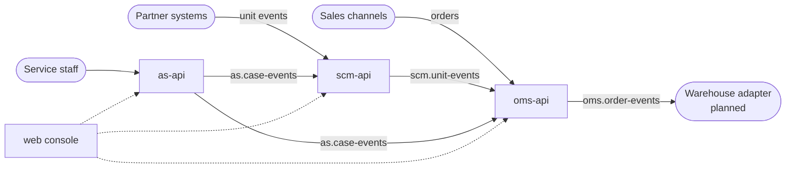

<div align="center">

# Logistics Hub

**Track every physical unit from factory to scrap — across systems you don't own.**

A supply chain control tower that records what partner systems report, corrects what they got wrong,
and keeps one trustworthy history per serial number.


</div>

---

## Why

Factories, warehouses, carriers and service centers each run their own software. None of them
sees the whole picture, and all of them contain mistakes: a warehouse worker scans the wrong
serial number, and the partner's system can no longer be fixed.

Logistics Hub does not replace those systems. It **integrates with them and keeps the record
straight**:

- **Record, don't execute.** Partners run the factory, the warehouse and the delivery. We record what happened to each unit.
- **Correct, never overwrite.** A wrong report is voided with a reason and an actor, and optionally replaced. The original stays in the history.
- **Flag, don't reject.** A report that makes no sense ("shipped before it was received") is still accepted, applied, and marked as an anomaly for a human to resolve.
- **One unit, one timeline.** Manufactured → received → stored → shipped in order X as part of bundle Y → delivered → DOA → scrapped, all queryable by serial number.

It is also a reference **NestJS + React monorepo template** built on current stable tooling:
TypeScript 7, ESM everywhere, pnpm catalogs, Turborepo, oxlint, Vitest.

> **Status:** early skeleton. The end-to-end lifecycle works across all three services; partner and
> sales-channel adapters, authentication and non-serialized stock are not built yet.
> See the [roadmap](docs/05-roadmap.md).

## What it does



| Area                  | Capability                                                                                                                        |
| --------------------- | --------------------------------------------------------------------------------------------------------------------------------- |
| **Unit ledger** (SCM) | Append-only event history per serial number, with business time and recorded time kept separately                                 |
| **Corrections**       | Void or replace a wrong fact; the unit's state is rebuilt from the facts that remain valid                                        |
| **Stock**             | Quantity by SKU × location × status, derived from corrected history rather than from partner books                                |
| **Order hub** (OMS)   | Ingest orders from sales channels, explode bundles into physical units, link each unit to the serial number that actually shipped |
| **DOA flow**          | An after-sales system confirms DOA → the unit is marked, the order line gets a replacement shipment, the scrap is recorded        |

The OMS here is deliberately narrow. Payments, refunds and customer service stay in the sales
channel; this system only answers _which physical unit fulfilled which order line_.

## Architecture



- **Three services, three databases.** Services never read each other's tables and never call each other synchronously — they only exchange events.
- **Transactional outbox** on the way out and **idempotent consumers** on the way in, so events are neither lost nor applied twice.
- **Broker behind an interface.** `MessageBus` has Kafka semantics (topics, consumer groups, at-least-once). Today it runs on Redis Streams; moving to Kafka means adding one adapter class.
- **Contracts in one package.** Event and request schemas (zod) and response types live in `@repo/contracts`, shared by the services and the web app.

## Quick start

Requirements: [mise](https://mise.jdx.dev) and a Docker runtime with `docker-compose`
(for example `brew install colima docker docker-compose && colima start`).

```bash
mise install      # pins Node and pnpm
mise run setup    # install deps, create .env files, start MySQL + Redis, run migrations
mise run dev      # three services + the web console
```

Then, in another terminal, replay a full unit lifecycle against the real APIs:

```bash
mise run demo
```

The demo manufactures units, places a bundle order, lets the warehouse report the **wrong serial
number**, corrects it, delivers, confirms a DOA, scraps the unit and ships a replacement.
Abridged output (the script prints in Korean):

```text
▶ Result — lifecycle of CAM-A
  MANUFACTURED      FAC-SZ    manufacturer
  DISPATCHED                  manufacturer
  RECEIVED          WH-ICN    3PL
  SHIPPED                     logistics-hub:correction
  DELIVERED                   carrier
  DOA_CONFIRMED               as-api
  RETURN_RECEIVED   SVC-SEL   service partner
  SCRAPPED                    as-api
  final status: SCRAPPED, anomalies: 0

▶ Result — fulfillment items of the order
  BAT-01  DELIVERED  BAT-A  ORDER
  CAM-01  DOA        CAM-A  ORDER
  CAM-01  DELIVERED  CAM-B  DOA_REPLACEMENT
  order status: FULFILLED
```

| App       | URL                   | Role                                                    |
| --------- | --------------------- | ------------------------------------------------------- |
| `web`     | http://localhost:5173 | Admin console: unit trace, stock, orders                |
| `scm-api` | http://localhost:3001 | Unit ledger, corrections, stock                         |
| `oms-api` | http://localhost:3002 | Order ingestion, bundle explosion, fulfillment tracking |
| `as-api`  | http://localhost:3003 | Minimal after-sales service for the DOA integration     |

## Project structure

```text
apps/
  scm-api  oms-api  as-api   NestJS services, one database each
  web                        Vite + React admin console
packages/
  contracts                  Cross-service contracts: event/request schemas (zod), response types
  messaging                  MessageBus interface + Redis Streams and in-memory adapters
  db-kit                     Drizzle building blocks: outbox, inbox, column conventions
  nest-kit                   Nest building blocks: infra module, typed config, logger, zod pipe
  typescript-config          Shared tsconfig presets
docs/                        Design documents
```

## Tech stack

| Layer     | Choice                                                    |
| --------- | --------------------------------------------------------- |
| Language  | TypeScript 7 (native compiler), strict settings, ESM only |
| Backend   | NestJS 12, Drizzle ORM, MySQL 9.7 LTS, zod 4              |
| Messaging | Redis Streams behind a Kafka-shaped `MessageBus`          |
| Frontend  | Vite 8, React 19, TanStack Router + Query, Tailwind CSS 4 |
| Monorepo  | pnpm 12 workspaces with catalogs, Turborepo 2, mise       |
| Quality   | oxlint (type-aware), Prettier, Vitest 5, GitHub Actions   |

The reasoning behind each choice is in [docs/04-decisions.md](docs/04-decisions.md).

## Development

| Command            | What it does                                                            |
| ------------------ | ----------------------------------------------------------------------- |
| `pnpm check`       | Build, type-check, lint, test and format check — the same thing CI runs |
| `pnpm dev`         | Start every app in watch mode                                           |
| `pnpm test`        | Run tests                                                               |
| `pnpm format`      | Format the whole repository with Prettier                               |
| `pnpm db:generate` | Generate migration SQL from schema changes                              |
| `pnpm db:migrate`  | Apply migrations                                                        |

Target a single workspace with `pnpm --filter scm-api dev` or `pnpm turbo run test --filter=oms-api`.

VS Code users: open `logistics-hub.code-workspace` to get each app and package as a top-level
folder, with format-on-save and lint wired up.

**Conventions worth knowing before you contribute**

- Dependency versions live only in the `catalog` of `pnpm-workspace.yaml`.
- No barrel files. Import by subpath: `@repo/contracts/scm`, not `@repo/contracts`.
- Events are published through the outbox (`enqueue(tx, ...)`), never directly.
- `unit_events` is append-only. Fix mistakes with a correction record.
- `main` only accepts pull requests that pass CI, merged with a merge commit.

## Documentation

The design documents are written in Korean.

| Document                                         | Contents                                                                                          |
| ------------------------------------------------ | ------------------------------------------------------------------------------------------------- |
| [01 Concept](docs/01-concept.md)                 | What the system does and does not do, its three principles, the boundary with OMS and after-sales |
| [02 Domain model](docs/02-domain-model.md)       | Tables, unit events and state transitions, corrections, bundles, DOA events                       |
| [03 Architecture](docs/03-architecture.md)       | Services and topics, outbox and idempotency, package dependencies                                 |
| [04 Decisions](docs/04-decisions.md)             | Technology choices and why                                                                        |
| [05 Roadmap](docs/05-roadmap.md)                 | What is not built yet                                                                             |
| [Git rules](docs/git-rules.md)                   | Commit and pull request conventions                                                               |
| [Architecture rules](docs/architecture-rules.md) | Layering inside each service: domain modules, use cases, presentation                             |
| [Agent workflow](docs/agent-workflow.md)         | How coding agents split, build and review work in this repository                                 |
